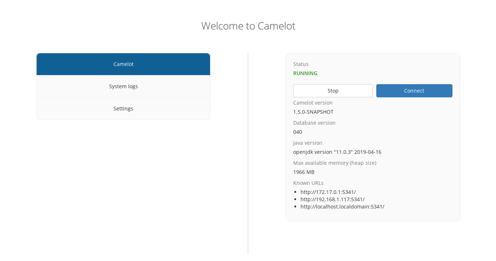

Administration interface
------------------------

Camelot's administration interface makes it easy to manage Camelot.  This
includes starting, stopping and accessing Camelot, viewing logs, and making
configuration changes.

We'll walk through each of the menu items in turn.

Camelot
~~~~~~~

The Camelot menu allows you to:

* Start and stop Camelot
* Connect to a already-running Camelot
* View status information about Camelot, such as which addresses it is accessible from.

The latter is most helpful when looking to connect to Camelot from |other_computers_in_the_network|.

.. |other_computers_in_the_network| raw:: html

   <a href="network.html">other computers in the network</a>

System logs
~~~~~~~~~~~

Sometimes not everything goes as planned. This is where the system logs may
prove handy to work out what is going wrong. Should you encounter an error and
need to raise |a_support_request|, attaching these logs to that request may
help to get the issue resolved more quickly.

.. |a_support_request| raw:: html

   <a href="https://gitlab.com/camelot-project/camelot/issues">a support request</a>

Settings
~~~~~~~~

Here you may configure Camelot's global settings.  These settings will take
effect the next time Camelot is started.

These settings fall into 3 broad categories:

1. Application settings
2. Advanced settings

Application settings
^^^^^^^^^^^^^^^^^^^^

Allows customisation of the way that the Camelot or its user interface behaves.

* **Species name style**: how the name of a species is shown in Camelot's user
  interface. This can be the scientific name or the common name of a species.
* **Send anonymous usage data**: if enabled, the Camelot team will receive
  anonymous data about how the software is being used, in order to help
  improve the software.

Wildlife detection
^^^^^^^^^^^^^^^^^^

This enables the wildlife detection capabilities of Camelot. See
|wildlife_detection| for more information.

.. |wildlife_detection| raw:: html

   <a href="detector.html">wildlife detection</a>

Advanced settings
^^^^^^^^^^^^^^^^^

Advanced settings are described below. These are considered advanced as they
provide a great deal of flexibility, however may have surprising or
undesirable results.

Should you have any doubts about these settings please reach out via the
|group_link|.

.. |group_link| raw:: html

   <a href="https://groups.google.com/forum/#!forum/camelot-project" target="_blank">forums</a>

Storage locations
=================

These settings allows customisation of where Camelot stores its data.

**Important**: Camelot will not move your data when customising any of these
locations. When changing any of these locations, any existing data you wish to
continue to use **must** be moved to this location manually.

* **Media location**: where Camelot's images should be stored. **Note** that this
  should not be the same location as *you* store your images. Camelot will
  maintain its own copy of any images, folders and images stored in this
  location **should not** be modified.
* **Database location**: the folder where Camelot will store its database. The
  Database folder **must not** be modified.  If you have an existing database
  you wish to use, this should be set to the **parent** of the "Database"
  folder.
* **FileStore location**: any files related to a survey can be uploaded to
  Camelot under the "survey files" menu. These files will be stored in this
  folder.  Files and folders in this location **should not** be modified.
* **Backup location**: Camelot will automatically back up its database before
  doing a database upgrade. These backups will be stored here.
* **Installation location**: The folder where the camelot .jar file is
  stored.
* **Log file location**: The location where Camelot log files are stored.

System configuration
====================

Allows customisation at the system level around how Camelot is started and how it runs.

* **Java command**: the location or name of the "java" command used to run Camelot.
* **JVM maximum heap size**: the amount of memory to allow Camelot to use in megabytes. This may need to be customised if working with |large_amounts_of_data|.
* **JVM options**: other options to pass to the "java" command. Refer to the documentation of your JVM for more details.
* **HTTP port**: the TCP port on which to run Camelot's HTTP server. This may be useful if you need to use a specific port due to firewall rules, for example.

.. |large_amounts_of_data| raw:: html

   <a href="scale.html#memory">large amounts of data</a>
