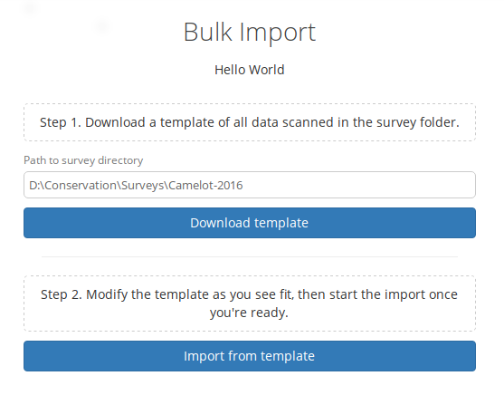
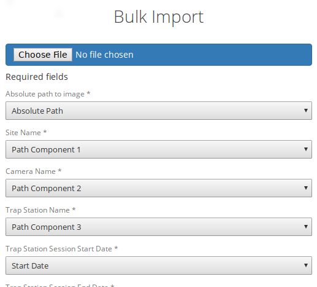
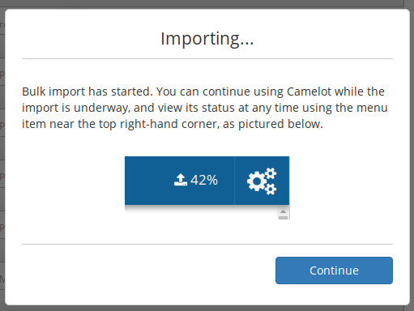

Bulk Import
-----------

**New in Camelot 1.1.0**

A Bulk Import in Camelot provides a means to import a survey's worth of
data at once. You're not left to your own devices when it comes to
preparing the data for import though, nor is it (entirely) on your
shoulders to make sure the data is correct -- Camelot will do its utmost
to help you with the import. This also means that there's a few things
to know about when it comes to bulk import!

Step 1: Creating a CSV
~~~~~~~~~~~~~~~~~~~~~~

The first thing to know is that a Bulk Import is a 2-step process, with
the first step being to create a CSV. If you already have all of the
data for every media file, you can move straight to the next step.
However Camelot is a tool for data management, which usually means the
data, well, may not be quite managed yet. But that's okay. A common
source of data is one of, or a combination of, spreadsheets, folder
names and image tags, and so the focus of Step 1 is collating the latter
two pieces of information into a spreadsheet where you can use your
spreadsheet prowess to fill in the blanks.

In Step 1, you will enter the path to a folder containing all of the
images for a single survey (this path can be copied out of the address
bar in Windows Explorer or Finder on OSX). Camelot will take a moment to
scan this directory and give you back a CSV file as a download. The CSV
file contains a row for every image, and columns for the file's
location, the file metadata, and folder names (labelled
``Path Component 1-n``).

The resulting CSV often contains hundreds of columns and tens of
thousands of rows, and so can take some time to generate. You can take
this CSV and move on to Step 2. It may be that there is yet some
additional data that needs to be added to the CSV, though in the Step 2
Camelot will indicate the data is required, if there are any mismatches.
If adding data manually, see below for the nitty-gritty about what
Camelot expects from the data.

Data expectations
^^^^^^^^^^^^^^^^^

Depending on how much data can be gleamed from the aforementioned
sources, there may be additional data you need to add in to this CSV
manually before it can be uploaded. This might include the Site Name,
Camera Name, Trap Station Name, GPS Longitude and Latitude and session
start and end dates. This is the guide to *how* that data should be
represented in the CSV.

First, every mappable field in Camelot must have its own column in the
CSV. For example, Camelot's session start and end dates cannot be
represented by a single column which contains a date range. It must be
represented by two columns. The exact format of the different types of
data are below:

-  **Latitude and Longitude**: specified as separate columns and in
   decimal GPS (where North and East are positive decimal numbers, South
   and West negative).
-  **Boolean fields** (e.g., *Media processed*): any of 'Yes/No', 'Y/N',
   'True/False', 'T/F' or '1/0'. Not case-sensitive. Representations may
   be mixed.
-  **Sighting Lifestage**: 'Adult/Juvenile' or 'A/J'. Not
   case-sensitive. Representations may be mixed.
-  **Sighting Sex**: 'Male/Female' or 'M/F'. Not case-sensitive.
   Representations may be mixed.
-  **Dates & Times**: Camelot is forgiving about Date and Time formats
   (though the author recommends ``YYYY-MM-DD hh:mm:ss``). Note that
   ``DD/MM/YYYY`` or ``MM/DD/YYYY`` are not permitted due to room for
   ambiguity. Be aware that spreadsheet software may default to using
   these date formats.
-  **Path name**: (e.g., *Absolute path*) Must be a path name to a
   readable file.
-  **Integer**: (e.g., *Sighting quantity*) Must be an integer.

The mapping screen in Step 2 offers a separate section for required and
optional of fields. For a required field, every cell in the mapped
column must have a valid value. For an optional column, some cells may
be blank (though non-blank cells must be valid for that field type).

Bulk Import when running Camelot in a client/server model
^^^^^^^^^^^^^^^^^^^^^^^^^^^^^^^^^^^^^^^^^^^^^^^^^^^^^^^^^

(If you are using bulk import from the same computer Camelot is running
on, you may safely ignore this section.)

The data must be accessible to the server itself so that it can be
scanned and uploaded. Clients can provide the path to the survey data
local to their machine (e.g., they can provide the path of the data in a
network drive, where the contents of the network drive are stored on the
Camelot server). Camelot will work out the location of the data relative
to the server. If running Camelot in a Client/Server configuration, it
is strongly recommended (for both performance and security reasons) to
set the ":root-path" configuration property in the config.clj on the
server and restart Camelot.

This is a somewhat complex topic. If there are any questions about Bulk
Import in relation to running Camelot in a system where separate
'client' computers may perform a bulk import, please
`ask <community.html#the-community>`__.

Step 2: Columns mapping and import
~~~~~~~~~~~~~~~~~~~~~~~~~~~~~~~~~~

The next step is uploading the CSV and assigning columns mappings from
the CSV to fields in Camelot.

Use the file selector to choose the CSV. Camelot will take a moment to
check the contents of the CSV and present a screen so that CSV columns
can be assigned to fields. Where possible, Camelot will provide default
mappings. You may attempt to assign any column to any field in Camelot.
If there is a problem, an error describing why the column isn't valid
for the field will be presented. This may be useful for working out what
corrections may be needed to the CSV before it can be uploaded.

.. figure:: screenshot/bulk-import-mapper-error.png
   :alt: 

Should you find that corrections to the CSV need to be made, make the
necessary changes in the CSV and upload it again. Where possible, all
mappings will be preserved and all mapping checks will be performed
again against the new CSV data.

Once the mapping configuration is valid, you will be able to submit the
data for final verification and to start the import.

Status of a Bulk Import
~~~~~~~~~~~~~~~~~~~~~~~

As a Bulk Import can be a time-consuming process, Camelot will run it in
the background and, in the meantime, Camelot is fully-functional.

The percentage of all running Bulk Imports is displayed towards the top
right-hand corner of the screen. You can hover over this for more detail
about the upload status, including time estimates and details of any
errors.

.. figure:: screenshot/bulk-import-status.png
   :alt: 

A running import can also be cancelled from this status pop-up using the
button immediately to the right of the progress bar, though be aware
that doing so will not remove anything already uploaded to the survey.

The survey will no longer be in "Bulk Import Mode" once its bulk upload
completes; from this point on Camera Trap Stations can be added manually
as usual.
