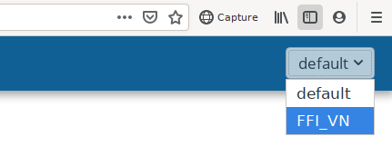

Multiple datasets
-----------------

*The features described on this page are coming in Camelot 1.6.0.*

Camelot offers the ability to manage multiple isolated collections of data (a
"dataset") within a single running Camelot.

There are other situations where you really want to keep data isolated from
each other, for example, as a contractor using Camelot to conduct research for
several clients. For this, Camelot offers datasets.

Essentially you can think of each dataset as being a different Camelot
database.

Configuration
~~~~~~~~~~~~~

In the |administration_ui| you can add additional datasets and configure the
location of the folders which comprise a dataset (more on this soon).  You can
also remove datasets. Note that the removal of datasets does **not** delete
the data; removal means only that it will no longer be available through
Camelot.

Note that after changing dataset configurations, you must stop and then
restart Camelot for those changes to take effect.

.. |administration_ui| raw:: html

   <a href="administration.html">administration interface</a>

Storage locations
=================

These settings allows customisation of where Camelot stores its data.

**Important**: Camelot will not move your data when customising any of these
locations. When changing any of these locations, any existing data you wish to
continue to use **must** be moved to this location manually.

* **Media location**: where Camelot's images should be stored. **Note** that this
  should not be the same location as *you* store your images. Camelot will
  maintain its own copy of any images, folders and images stored in this
  location **should not** be modified.
* **Database location**: the folder where Camelot will store its database. The
  Database folder **must not** be modified.  If you have an existing database
  you wish to use, this should be set to the **parent** of the "Database"
  folder.
* **FileStore location**: any files related to a survey can be uploaded to
  Camelot under the "survey files" menu. These files will be stored in this
  folder.  Files and folders in this location **should not** be modified.
* **Backup location**: Camelot will automatically back up its database before
  doing a database upgrade. These backups will be stored here.

Switching datasets
~~~~~~~~~~~~~~~~~~

Once there are multiple datasets configured, you can move between them using
the dataset switcher in the top right hand corner.

