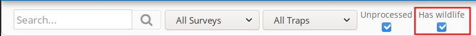
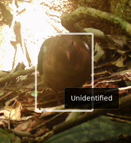
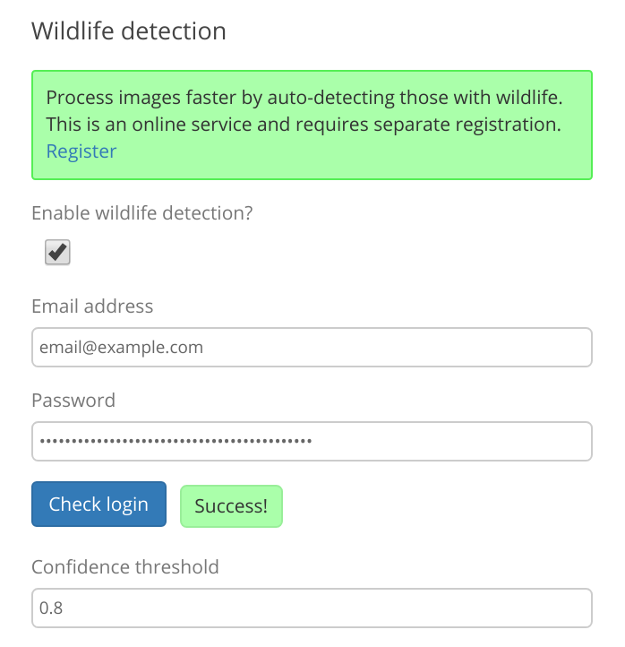
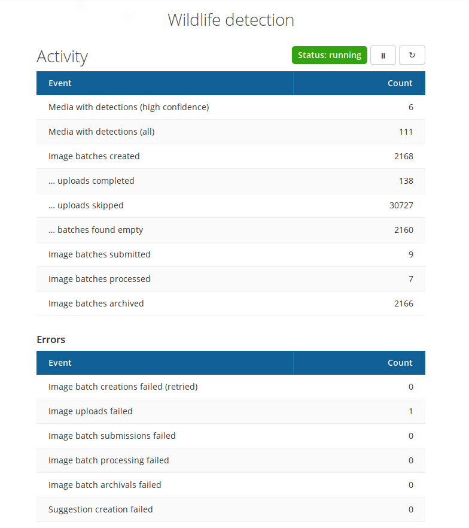

Animal detection
------------------

*The features described on this page are coming in Camelot 1.6.0.*

Typically most images captured by motion-triggered cameras are do not have
valuable content, as the motion sensor was triggered for reasons other than
some nearby animal, such as the wind.  The result is that much time tends to
be spent sifting through images to find those that actually have interesting
content.

To help you focus on the images that matter most, Camelot offers animal
detection. In practice, this enables two features:

1. the ability to filter images in the library based on whether they have
   animals or not, even before they have been processed

2. bounding boxes around the detected animals

Setup
~~~~~

Animal detection is provided via an online service. As such, its use requires
an adequate internet connection and it is only available after registration.

For most users, set up is a simple matter of following the prompts in the
|administration_ui|:

.. |administration_ui| raw:: html

   <a href="administration.html">administration interface</a>

Once login has succeeded, save the configuration, restart Camelot, and the
animal detection should now start to upload & process the available images.

How it works
~~~~~~~~~~~~

Once set up, the animal detection automatically starts, and will continue
behind-the-scenes. You can see a summary of this detection activity at any
time via the top "Detection" menu:

The detection starts by retrieving the cameras for each session of all trap
stations.  A batch of images is formed for each of these cameras, which is
referred to as a 'image batch creation'.

Once a batch is created, images will be uploaded to secure cloud storage
location dedicated to this image batch.  When all images have been uploaded,
this batch is submitted for processing.

Camelot has partnered with Microsoft's |ai_for_earth| team, who at this stage,
perform the image processing using their machine learning models. Processing
can take some time, typically between several minutes and several hours,
depending on the number of images in the batch.  Camelot will periodically
check for new results for the submitted batches.

Once processed, the suggestions offered by the image processing are created in
Camelot.  "High confidence" suggestions are reflected in the library in the
image filtering, and with bounding boxes.

Whether a suggestion is considered "high-confidence" is determined by the
"Confidence threshold" setting in the Administration UI, which is a number
between `0` and `1` indicating the likelihood of the suggestion being correct.
Suggestions made at or beyond this level of confidence are "high-confidence".

The threshold can be changed at any time. All suggestions are stored by
Camelot regardless of the confidence threshold, so changes to the threshold
apply retrospectively.

Filtering
~~~~~~~~~

Suggestions created by animal detection include whether the an `animal` or
`person` was detected. The "Has animal?" filter in the Library shows only
those images that have a high-confidence `animal` suggestion, or has an
identification.

Images with high-confidence suggestions that they contain people can be shown
using the filter:

`suggestion-key:person`
