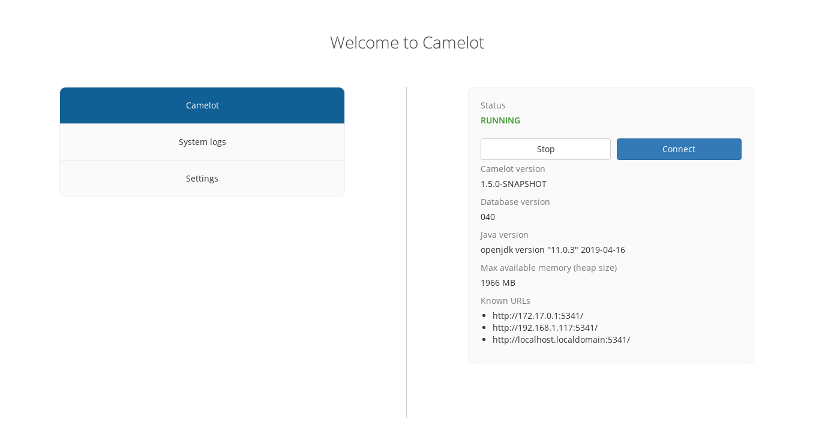

Getting started
---------------

Prerequisites
~~~~~~~~~~~~~

Java Runtime
^^^^^^^^^^^^

Camelot requires Java 8u91 (on later) to be installed on the system it
will run on before it can be used.

Java can be downloaded here:

|jre_link|

.. |jre_link| raw:: html

   <a href="http://www.oracle.com/technetwork/java/javase/downloads/index.html" target="_blank">http://www.oracle.com/technetwork/java/javase/downloads/index.html</a>

If using OSX, you will need to install the "JDK". For Windows and Linux,
you can install either the "JRE" or the "JDK".

*Note*: If you already have Java installed on your system, we recommend making
sure it's Oracle's Java implementation, and not OpenJDK.  OpenJDK is known to
have problems uploading some images.

Web browser
^^^^^^^^^^^

Camelot supports the latest versions of the following browsers:

-  Chrome
-  Firefox
-  Edge

Installation
~~~~~~~~~~~~

OS-specific releases (recommended)
^^^^^^^^^^^^^^^^^^^^^^^^^^^^^^^^^^

Camelot has OS-specific releases, which are the recommended way to install
Camelot:

* `Windows <https://s3-ap-southeast-2.amazonaws.com/camelot-project/release/camelot-1.5.7-win32-x64.zip>`__
* `MacOS <https://s3-ap-southeast-2.amazonaws.com/camelot-project/release/camelot-1.5.7-darwin-x64.zip>`__
* `Linux <https://s3-ap-southeast-2.amazonaws.com/camelot-project/release/camelot-1.5.7-linux-x64.zip>`__

Start Camelot by running "Camelot" application in the extracted archive.

**Note**: Older computers running a 32-bit OS of any of the above must instead
 use the Java release below.

Java .jar release
^^^^^^^^^^^^^^^^^

A Java .jar file is also available:

* `Servers, 32-bit OSs and others <https://s3-ap-southeast-2.amazonaws.com/camelot-project/release/camelot-1.5.7.zip>`__

This release can be used on any operating system, though does not feature an
administrative interface.

On startup
~~~~~~~~~~

When Camelot is first started, it will open the administration interface &
begin to start up the main Camelot application, which can take a few seconds.

This interface can be used to start and stop Camelot, view logs and configure
Camelot.  See |administration_ui| for more information.

Once the main Camelot application starts up, it will be appear immediately.
You can return to the administration interface at any time by clicking the '←'
icon in the bottom left hand corner of the screen.

**Note**: This icon will not be available in the .jar version of Camelot, or
 when Camelot is accessed via a web browser.

.. |administration_ui| raw:: html

   <a href="administration.html">administration</a>

Web-interface
~~~~~~~~~~~~~

Camelot supports a multi-user environment where multiple other users can
connect to a main Camelot instance via their web browser.

The URL which web browsers may connect to can be found in the administrative
interface, under: **Camelot** → **Known URLs**

A user may access Camelot over the network by entering this URL into their web
browser.

**Note**: In the event that attempting to access Camelot over the network
fails, confirm Camelot is running and check the firewall rules of the computer
running Camelot.
