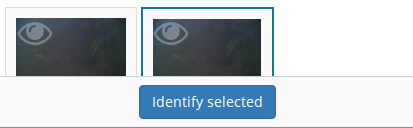

Library
-------

So you've had camera traps in the field for a while and collected a bunch of
photos. Now's where the *library* comes in. All of your photos can be viewed,
searched, flagged and identified through the library.

Viewing photos
~~~~~~~~~~~~~~

The "viewing" portion of the library consists of 3 main parts:

.. figure:: screenshot/library.png
   :alt: 

1. A photo can be *selected* by clicking on the photo on the "media
   collection" view on the left. When a photo has a green border, it is
   a selected photo.
2. When selecting a photo, a preview for it will be displayed in the
   preview panel in the middle of the screen.
3. Details for the currently viewed photo are available by clicking the
   "Details" tab on the right of screen to expand that panel.

Selecting is an important concept in the library, as most actions will
apply to the current selection. Multiple photos can be selected by
holding the "control" key and clicking a photo. Allowing multiple photos
to be selected is one technique Camelot uses to make processing of
photos quicker and easier.

Camelot's media collection shows 150 images per page. Clicking the left
and right arrows immediately above will change the page of photos
displayed. "Selecting all" will select all photos on the page.

A photo can be viewed without being selected (useful if you have
multiple photos selected already) by clicking the "eye" icon in the top
left hand corner of each photo in the media collection panel.

Finally, you might notice some photos have either a blue or red border
around them. A blue border indicates the image is "processed", while a
red border is "attention needed". If an image is flagged as processed
and attention needed, the border will be red; attention needed takes
precedence.

Enhancing photos
~~~~~~~~~~~~~~~~

Sometimes photos are over- or under-exposed which makes identification
difficult. Controls for brightness and contrast are available to temporarily
enhance the image for the purpose of identification by hovering over the
bottom left hand corner of the currently viewed image.

Flagging photos
~~~~~~~~~~~~~~~

A flag is one of the four icons towards the top right of the library:

.. figure:: screenshot/library-flags.png
   :alt: 

From left to right these are:

-  **Needs Attention**: mark the photo is needing further review.
-  **Test fire**: the photo was triggered by someone attending to or
   testing the camera.
-  **Processed**: identification of the photo is complete. If a photo
   doesn't show any species, it can and should be marked as processed
   without any species being identified in it.
-  **Reference Quality**: the photo has a species in it, and the photo
   of that species is a great example to refer to when doing future
   identification. (See: "Reference Window")

These can be set and unset by clicking on the respective icon. It will
apply to all photos currently selected.

Identifying photos
~~~~~~~~~~~~~~~~~~

Identification in Camelot is the process of indicating which species are
present in a photo. When you're ready to identify the selected photos,
the mode for submitting details can be accessed via the "Identify
Selected" button in the bottom left hand corner of the library.

To submit an identification, set the species from the drop down, adjust
the quantity if necessary, specify other identifiable details from the
appropriate drop down and click "Submit". The identification panel will
disappear and the photo will automatically be marked as "Processed".

.. figure:: screenshot/library-identify.png
   :alt: Floating species identification panel on the LHS.

Sometimes you'll come across a species you didn't expect to see in a
survey, and haven't encountered before. You can add this right away by
using the "Add a new species..." option in the species dropdown, and
then typing the species scientific name in the input field which
appears. This species will also be added in case it's needed in future.
Quick and easy.

If you need to know which species have already identified in a photo,
these can be viewed (and removed) via the details panel. If there aren't
any species identified in a photo, there will not be any listed in the
details panel for that photo.

The identification details entered will be applied to all photos
currently selected.

Removing photos
~~~~~~~~~~~~~~~

The currently viewed photo, if no longer required, can be removed via
the Delete button located at the bottom of the Details sidebar.

Searching
~~~~~~~~~

.. figure:: screenshot/library-search-bar.png
   :alt: 

The search bar will change the photos shown in the media collection to
only those which match the search. The search bar has a few common
search constraints readily-available: the survey, the trap station and a
checkbox to show only unprocessed. And of course a text input field
where you can just type and press the search button (or "enter").

The text input field deserves a little bit more explanation. It can be
used for simple searches, like typing the name of a camera to find all
photos taken by it, or the name of a species (or genus). But it can also
be used for much more specific searches.

If you wanted to find all photos at a certain sublocation, you could
start typing:

::

    site-s

.. figure:: screenshot/library-search.png
   :alt: 

At this point you should see completions below the input field for
"site-sublocation" and "site-state-province". Click "site-sublocation"
to complete it for you, and, if you had set up some sublocations for
sites previously, you'll notice another drop down: all of the
sublocations in Camelot.

Here `:` means "is equal to", though Camelot supports other search operators
too. For example:

::

    captured>=2018-01-01

The following operators are available: `:` (aka, `==`), `<`, `<=`, `>=`, `>`,
and `!=`.

Sometimes you want to search based on more than one thing. For example,
all photos at a site AND featuring a certain species. Can do:

::

    site-name:uluru species:"Osphranter rufus"

Camelot can also do searches with disjunctions:

::

    site-name:uluru | species:"Osphranter rufus"

Note the pipe ('\|') in the above example: this means "OR" in a search.

Camelot also supports negation. For example, to find all photos which are
flagged but do not have any species:

::
    flagged:true !species:*

We think Camelot's search is pretty handy, and hope you think so too.

Reference window
~~~~~~~~~~~~~~~~

The reference window is used to help with difficult identifications and
make identification more accurate by using photos you have already
classified. By clicking the reference window, Camelot will open a new,
specialised version of the library in another window which will display
only photos marked as "Reference Quality" (see "Flagging Photos").

Once opened, the media available through in the Reference Window will
change depending on the species selected in the identification dropdown
in the main Camelot window. This can also be useful if there are a
several possible species: by selecting the different species in the
species identification drop down in the main window, you can quickly
preview other photos identifying this species.

A possible workflow is that clear photos are identified first and marked
"Reference Quality" where appropriate. Photos which are not so easy to
identify can be marked as "Attention Needed". After making a pass
through the easy identifications, you can then come back and use the
Reference Window, and quality photos you have already collected, to help
with making identifications of species in those more tricky photos.

This window is designed to be put on a second monitor, but if that is
not available, can also be accessed quickly via "Alt-Tab".

Keyboard shortcuts
~~~~~~~~~~~~~~~~~~

So that trap photos can be processed efficiently, the Library has a
number of keyboard shortcuts:

-  **Control + d**: Toggle the details panel
-  **Control + i**: Open the identify panel
-  **Shift + <**: Go to the previous page of media
-  **Shift + >**: Go to the next page of media
-  **Control + f**: Focus the filter text input
-  **Alt + f**: Reapply the current filter
-  **Control + a**: Select all media (or select none, if all are
   selected)
-  **f**: Flag the currently selected media
-  **g**: Mark the currently selected media as processed
-  **r**: Mark the currently selected media as being of reference quality
-  **c**: Mark the currently selected media as a camera-check (i.e.,
   test-fire of the camera)
-  **Shift** + **Arrow key** to include media in a range, starting from the last selected image.
-  **Control** + **Arrow key** to toggle the next image in that direction in the current selection.
-  **Delete**: Delete the selected media

Holding **Shift** or **Control** and clicking an image with the mouse will perform the equivalent behaviour.

Library Filters
~~~~~~~~~~~~~~~

