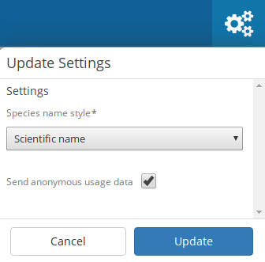

Settings
--------

In the top right hand corner of the main navigation is the toggle to
show the settings menu. The settings menu in Camelot provides several
options:

- **Species name style**: Whether species scientific or common names should be shown by default. Default is scientific names.
- **Send anonymous usage data**: Enabled this option will provide data about how you use Camelot back to the Camelot Project. This data is anonymous and is used only for the purpose of improving Camelot. It is disabled by default, though if you have the consent of others using your Camelot instance, please consider enabling this.
