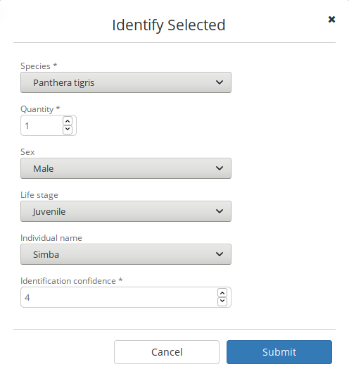
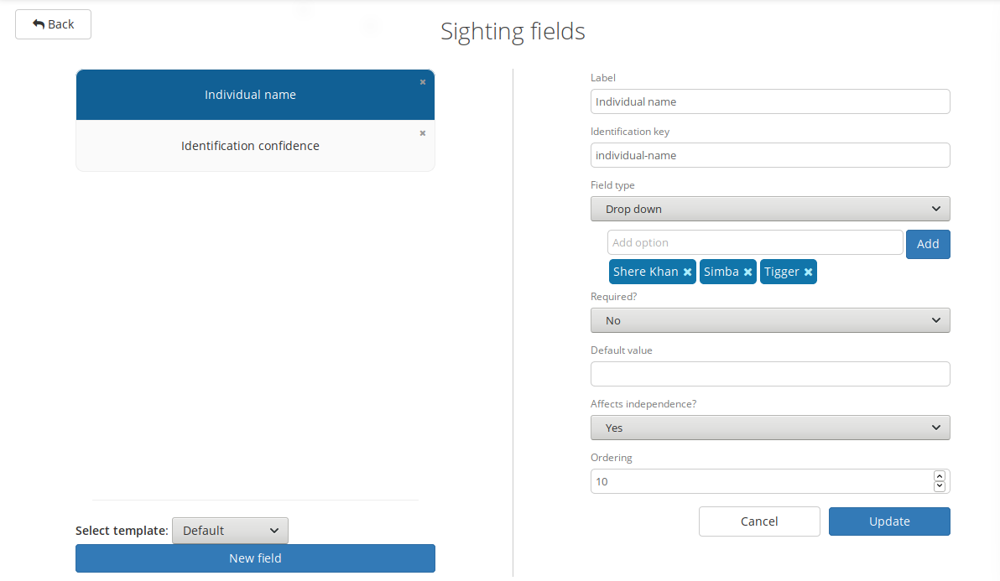
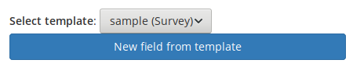

Sighting fields
---------------
**Sighting fields are a new feature which will be available in Camelot 1.3.0**

Some surveys require more specific data to be captured when identifying media. For this, Camelot provides *sighting fields*. Sighting fields are additional input fields during identification.

The number and type of fields available is fully user-configurable, and can be configured on a per-survey basis.

Managing sighting fields
~~~~~~~~~~~~~~~~~~~~~~~~

Sighting fields can be configured by navigating from within the main Survey menu to:

**Settings** → **Sighting fields**

You can get started with creating a sighting fields by clicking **New field** towards the bottom left hand corner.  On the right, a menu will appear.  Let's go through the fields, and what they mean.

Configuration options
~~~~~~~~~~~~~~~~~~~~~

**Label**: the name which will be associated with the sighting field.

**Identification key**: the identifier of the field. The role of the identifier is to group fields across multiple surveys, and to give a way to refer to the field when searching by field in the library, or when defining custom reports.

Any name consisting of alphanumeric characters and hyphen ('-') is a valid identifier.  When being referred to, such as when defining a custom report, the identifier given here will always need to be prefixed by `field-'. (e.g., `field-individual-name').

By default, the identification key is automatically generated by the label and it is generally fine to accept the default.

**Field type**: the type of input field which will be presented during identification. Some field types, such as the drop down, have additional options which may be specified when selected.

When selecting the drop down field type, options in the dropdown may be added and removed. At least one option must be present.

**Required**: whether, during identification, a value must be provided.

**Default value**: if specified, pre-fills the input with the given value.

**Affects independence?**: Camelot will assess whether two given sightings are *independent* when producing some reports.  Some fields have a meaningful impact on independence, while others do not.  This is best explained by example.

*Example*: Where a sighting field identifies an individual, a sighting for "Simba" and a later sighting for "Mufasa" always depicts two distinct sightings regardless of the span of time between them.  However, a field for the confidence of a sighting -- say if one sighting was confidence "5", and another confidence "3" -- would not alone be an indication that these are two *distinct* sightings if they were sufficiently close together.

**Ordering**: defines the order of fields will appear in the user interface. Lower values for ordering appear higher, relative to other sighting fields.

Templates
~~~~~~~~~

Sighting fields from other surveys may be used as a *template*.  When there are sighting fields configured for other surveys, they may be used as a template for a new sighting field for the current survey and will be available via a drop-down menu above the "New field" button.

This will pre-fill the fields on the right hand side, allowing modification before the sighting field is created.

Sighting fields will be available in this drop-down so long as the survey does not already have a sighting field with that identification key already defined.
