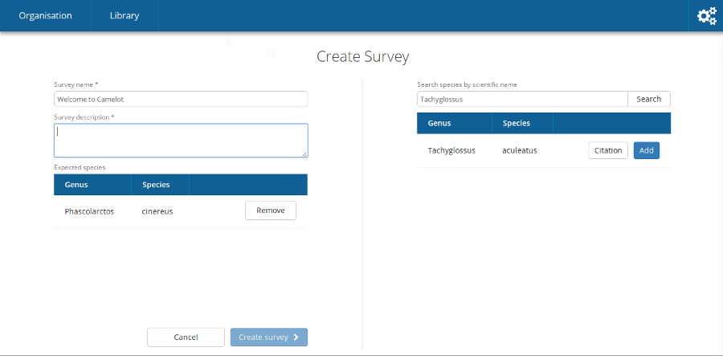

Creating a survey
-----------------

The left hand side is the current survey configuration. You can give a
survey a name and description. A survey will often start with one or
more species are expecting to be found over the course of the study.
Species can be added by searching for the scientific name using the
right-hand panel. Behind the scenes, Camelot will automatically set
additional details about the species, including its family and common
name.

Once ready, click "Create Survey".

At this stage you will be prompted asking whether you already have the data
available for the survey to do a Bulk Import. If you have already collected
all of the media for this survey, you may wish to select "Set Up with Bulk
Import".

If unsure, you should choose "Create Survey" at this prompt. Should you choose
"Set Up with Bulk Import", the survey will require the initial setup of the
survey to be completed via Camelot's Bulk Import capabilities.  Refer to `Bulk
Import <#bulk-import>`__ for more information on Bulk Import.

.. figure:: screenshot/survey-bulk-import-prompt.png
   :alt: Bulk Import prompt

The ordering of sections in this guide will assume you choose "Create Survey"
here, and that you will add data for your survey and organisation
incrementally.
