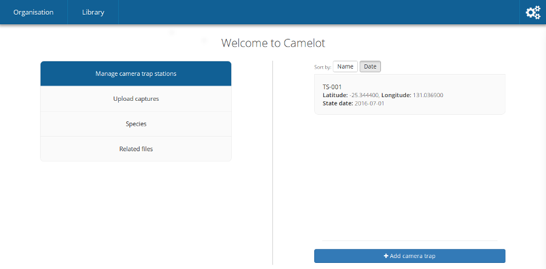

Creating a survey
-----------------

The first thing you'll see when the main Camelot interface loads is the
"Create Survey" screen.  A survey represents a research project and will
contain details about your camera traps and uploaded images.

The left hand side is the current survey configuration. You can give a
survey a name and description. A survey will often start with one or
more species are expecting to be found over the course of the study.
Species can be added by searching for the scientific name using the
right-hand panel. Behind the scenes, Camelot will automatically set
additional details about the species, including its family and common
name.

.. figure:: screenshot/survey-create.png
   :alt: 

Once ready, click "Create Survey".

Managing surveys
----------------

Survey management is the heart of Camelot, and also where it differs the
most from other camera trap software. Our research shows that by
understanding the next few sections, you'll be well on your way to being
a Camelot expert. So listen up!

The authors recommend physically setting up the cameras, and noting the
installation details, before recording those details in Camelot. If you
can record the details into Camelot while in the field, even better!

Manage camera trap stations
~~~~~~~~~~~~~~~~~~~~~~~~~~~

This menu shows all past and present camera trap stations, and also
allows you to add another camera trap station to the field. A quick
refresher: a camera trap station is one or two cameras at a specific
location.

There are two pages in setting up a new camera trap. The first page has
the *essential* information. All of the fields on this screen must be
completed, with the exception of the "secondary camera" in the case
there was only 1 camera installed. While on the subject of cameras,
don't be concerned about the distinction between "primary" and
"secondary" cameras: Camelot is a fair master and treats both cameras
equally.

.. figure:: screenshot/camera-trap-add.png
   :alt: 

Once you're happy with all of the essential details, click "Next". You
can now set up any of the optional data for the camera trap. This should
be pretty self-explanatory. This data, if provided, would usually be for
reporting and analysis purposes later. Once you're happy with
everything, click "Create".

If you've used other camera trap software, you may now be starting to
notice some differences: the trap station, and the start date, and the
cameras -- they were all on the one screen! What if you need to change
cameras later? Do not fear, Camelot supports all of this. Read on!

After creating a camera, you will see it under the "Manage camera trap
stations" menu. All camera traps will be shown on this menu, with camera
traps which are no longer active in the field being marked as
"Finalised". Each of these cameras can be clicked on to view its
details, or if not finalised, to record details about a *camera check*.

So that's a piece of terminology which has not been introduced until
now: a **camera check** is the process of going to a camera trap
station, making sure the cameras are okay, collecting the media they've
taken and doing any maintenance required (e.g., replacing batteries).

After checking a camera trap station and collecting the media, this
information must be entered into Camelot. Recording a camera check
requires 3 pieces of data:

-  What date was the camera check performed?
-  What happened with the "primary" camera?
-  What happened with the "secondary" camera?

.. figure:: screenshot/camera-check-add.png
   :alt: 

Camelot facilitates the following scenarios, for each of the cameras:

-  Whether or not media was successfully recovered from the camera.
-  If the camera was lost/stolen/retired or was taken to be used
   elsewhere ("available for use"). This will *unassign* that camera
   from the camera trap station.
-  If the camera was previously installed and is still installed, it
   remains "Active in the field".
-  If that camera was replaced with another, you can specify the
   replacement camera or indicate "No replacement camera"

Also, if there wasn't previously a second camera installed, a new
secondary camera can be selected.

When all of the details are correct, click "Submit".

When submitting, one of two things will happen:

1. If there were still cameras assigned to that trap station (i.e.,
   either a camera was still "Active in the field", or a new camera was
   assigned), Camelot will mark the camera check date as the last date
   of a the session, and start a new session on this date. Or,

2. If a check was submitted where there are now no cameras at a trap
   station, that trap station is no longer active and will no longer be
   available for management. If this happens there's nothing stopping
   you from adding a new camera trap station at that location later on,
   but right now, Camelot knows photos aren't being taken, and will take
   care of finishing it up for you.

Phew, okay that was a lot to take in! Reward yourself with a cup of tea
and biscuit. The main take away is that Camelot will do a stack of
behind-the-scenes book-keeping work for you. Managing camera trap
stations is all about telling Camelot what happened, and it will take
care of the rest for you.

Upload media
~~~~~~~~~~~~

That last section went on for *ages* about managing camera trap
stations, and doing checks and collecting media, but didn't say how to
actually upload the photo! What gives? Well, good news, now we're all
set up to start uploading photos.

Click on "Upload media" on the main menu, and Camelot will show a list
of cameras we've collected media for. Camelot knows this because we've
submitted a camera check, for that camera, and we said we had "recovered
the media". (If this is all double-dutch to you, see the section on
"Managing Camera Trap Stations" above.)

.. figure:: screenshot/media-upload.png
   :alt: 

To upload the media, it's as simple as opening your file browser,
selecting all the files taken by that camera over the time period shown,
and dragging them on to it! Camelot will show a progress bar, telling
you how the upload is going. If there are any problems, a "Show Details"
link will appear below the progress bar, which will give you the
low-down.

You can upload multiple sets of files to a camera, and even be uploading
to many cameras at once. You should not leave the "Upload media" menu
while photos are uploading, as doing so may interrupt the upload.

Once all of the uploads are complete -- you will know this, as all of
the progress bars will be full -- you can head on to the *Library* to
start identification.

Species
~~~~~~~

This provides a list of species either expected or encountered during a
survey. You can click on any species in the list in order to edit the
details about the species, such as its common name, family and mass
category. Note that changes made to the species details here will apply
to all surveys.

To change the species available in a survey, click "Manage Species"
towards the bottom of the right hand panel. From this menu, you'll be
able to remove species using the menu to the left and add species using
the options to the right.

Removal is simple: if you want to remove a species, click "Remove".
Removing a species will only change its availability in the
identification dropdown for a survey. If photos in the survey have
already been identified with this species, they will still be, and as
such these species will also appear on reports for the survey.

.. figure:: screenshot/species-manage.png
   :alt: 

To add a species, there's a bit more involved. Camelot gives 3 different
ways to add a species:

-  Select the species from the dropdown, if it's already known to
   Camelot.
-  Search by scientific name, when a species is not in the dropdown and
   you would like the details about the species, like Common name and
   Family, automatically set up.
-  The final option is useful when a species hasn't been added to
   Camelot before, and isn't available in the search. Select "add a new
   species..." from the dropdown, type the scientific name of the
   species, and click "Add".

Click "Done" to save your changes.

Related files
~~~~~~~~~~~~~

It's nice to be able to keep related data all in the same place, and
this is the goal of the related files. You can upload any file you like
to Camelot using the file picker towards the bottom of the window, and
it will be added to the list of files for this survey and available to
view anytime you like.
