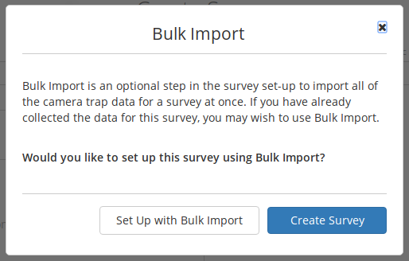
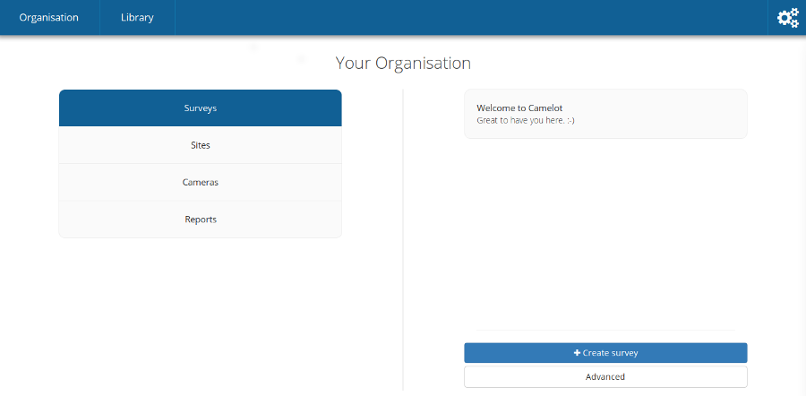
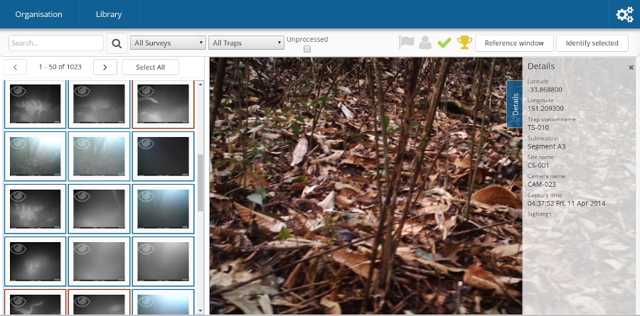
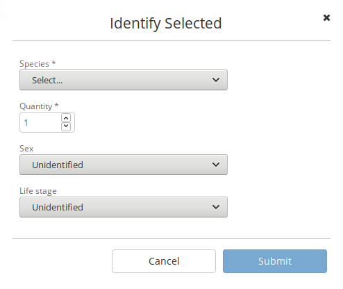
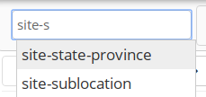
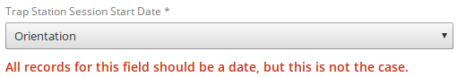
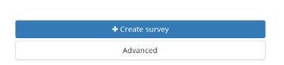
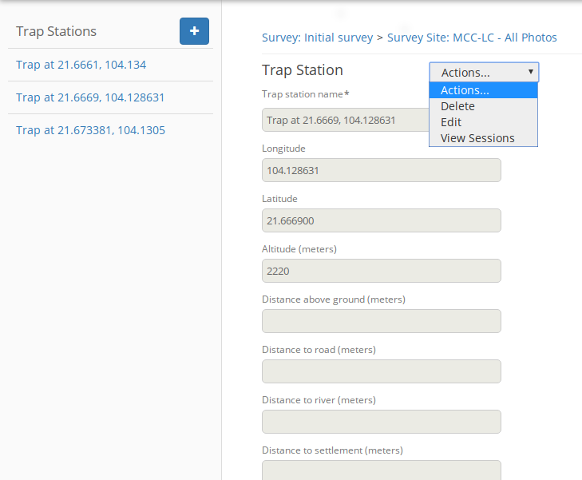

User guide
----------

Concepts in Camelot
~~~~~~~~~~~~~~~~~~~

The first time you run Camelot, you'll be taken to the 'Create Survey'
screen. Now would be good time to explain what a survey is, and some
other important concepts in Camelot.

-  **Survey**: a survey corresponds to a research project. All of the
   data collected will be part of a survey.
-  **Camera**: a single, physical camera. Each camera should be given a
   name and labeled.
-  **Camera Trap Station**: one or two cameras installed at a very
   specific location.
-  **Site**: a geographic area. Typically multiple camera trap stations
   will be in each site.
-  **Media**: a photo from a camera trap.

With terminology out of the way, onwards to creating a survey!

Creating a survey
~~~~~~~~~~~~~~~~~

The left hand side is the current survey configuration. You can give a
survey a name and description. A survey will often start with one or
more species are expecting to be found over the course of the study.
Species can be added by searching for the scientific name using the
right-hand panel. Behind the scenes, Camelot will automatically set
additional details about the species, including its family and common
name.

.. figure:: screenshot/survey-create.png
   :alt: 

Once ready, click "Create Survey".

**New in Camelot 1.1.0** At this stage you will be prompted asking
whether you already have the data available for the survey to do a Bulk
Import. If you have already collected all of the media for this survey,
you may wish to select "Create and import". Refer to `Bulk
Import <#bulk-import>`__ for more information.

The ordering of sections in this guide will assume you choose "Create
only" here, and will add data for your survey and organisation
incrementally.

Your organisation
~~~~~~~~~~~~~~~~~

This is where understanding the concepts in camelot is invaluable. On
this menu, concepts are on the left, and the details about the selected
concept are on the right.

You'll notice Sites and Cameras are not *within* a survey. This allows
for some more sophisticated, *longitudinal* reports, where data is not
only able to be analysed by survey, but also across multiple surveys.
For the same reason, reports live in this menu too.

Each concept can be selected from the menu on the left, and then a
specific entry navigated to using the menu on the right. You'll find
that this is a common pattern in Camelot.

Surveys
^^^^^^^

Surveys you'll already be familiar with. The right hand side shows all
surveys, and allows you to add a survey. You can click on any survey in
the list to manage it, but let's first look at the other concepts.

Sites
^^^^^

The sites menu will have a very similar feel to the survey menu. The
main difference is that a site can be created just by entering a name
and clicking "Add". This lets you set up multiple sites very quickly,
but if you want to come back and provide more information, you can click
on the entry for that site in the list to access all the details.

Adding details to a site is just a matter of filling in the fields and
clicking "Update".

.. figure:: screenshot/site-edit.png
   :alt: 

Cameras
^^^^^^^

The camera menu functions almost identically sites menu just discussed.
Cameras are added by entering its name and pressing add right in the
right-hand menu, though you're free to edit the camera afterwards to
give more details too. After creating a camera you'll notice a label
alongside each camera (most likely "Available for use" if you've just
added one).

A handy feature is being able to filter the list to find all cameras
with a particular status or camera name. For example, imagine you have
dozens of cameras, many of which are in the field, you can search
"available" to see the cameras marked "Available For Use". Camelot
ensures the camera status is updated as it is used in, and removed from,
camera trap stations.

Reports
^^^^^^^

A *report* is an export of data to a CSV. Clicking on a report will take
you to a report configuration screen, where you can set constraints for
that report (e.g., to report on a specific survey) and then generate the
data as a CSV.

Camelot comes with a bunch of reports out of the box. For advanced
users, it also lets you build and add your own reports. Reports will be
covered in much more detail later.

Managing surveys
~~~~~~~~~~~~~~~~

Survey management is the heart of Camelot, and also where it differs the
most from other camera trap software. Our research shows that by
understanding the next few sections, you'll be well on your way to being
a Camelot expert. So listen up!

The authors recommend physically setting up the cameras, and noting the
installation details, before recording those details in Camelot. If you
can record the details into Camelot while in the field, even better!

Manage camera trap stations
^^^^^^^^^^^^^^^^^^^^^^^^^^^

This menu shows all past and present camera trap stations, and also
allows you to add another camera trap station to the field. A quick
refresher: a camera trap station is one or two cameras at a specific
location.

There are two pages in setting up a new camera trap. The first page has
the *essential* information. All of the fields on this screen must be
completed, with the exception of the "secondary camera" in the case
there was only 1 camera installed. While on the subject of cameras,
don't be concerned about the distinction between "primary" and
"secondary" cameras: Camelot is a fair master and treats both cameras
equally.

.. figure:: screenshot/camera-trap-add.png
   :alt: 

Once you're happy with all of the essential details, click "Next". You
can now set up any of the optional data for the camera trap. This should
be pretty self-explanatory. This data, if provided, would usually be for
reporting and analysis purposes later. Once you're happy with
everything, click "Create".

If you've used other camera trap software, you may now be starting to
notice some differences: the trap station, and the start date, and the
cameras -- they were all on the one screen! What if you need to change
cameras later? Do not fear, Camelot supports all of this. Read on!

After creating a camera, you will see it under the "Manage camera trap
stations" menu. All camera traps will be shown on this menu, with camera
traps which are no longer active in the field being marked as
"Finalised". Each of these cameras can be clicked on to view its
details, or if not finalised, to record details about a *camera check*.

.. figure:: screenshot/camera-trap-manage.png
   :alt: 

So that's a piece of terminology which has not been introduced until
now: a **camera check** is the process of going to a camera trap
station, making sure the cameras are okay, collecting the media they've
taken and doing any maintenance required (e.g., replacing batteries).

After checking a camera trap station and collecting the media, this
information must be entered into Camelot. Recording a camera check
requires 3 pieces of data:

-  What date was the camera check performed?
-  What happened with the "primary" camera?
-  What happened with the "secondary" camera?

.. figure:: screenshot/camera-check-add.png
   :alt: 

Camelot facilitates the following scenarios, for each of the cameras:

-  Whether or not media was successfully recovered from the camera.
-  If the camera was lost/stolen/retired or was taken to be used
   elsewhere ("available for use"). This will *unassign* that camera
   from the camera trap station.
-  If the camera was previously installed and is still installed, it
   remains "Active in the field".
-  If that camera was replaced with another, you can specify the
   replacement camera or indicate "No replacement camera"

Also, if there wasn't previously a second camera installed, a new
secondary camera can be selected.

When all of the details are correct, click "Submit".

When submitting, one of two things will happen:

1. If there were still cameras assigned to that trap station (i.e.,
   either a camera was still "Active in the field", or a new camera was
   assigned), Camelot will mark the camera check date as the last date
   of a the session, and start a new session on this date. Or,

2. If a check was submitted where there are now no cameras at a trap
   station, that trap station is no longer active and will no longer be
   available for management. If this happens there's nothing stopping
   you from adding a new camera trap station at that location later on,
   but right now, Camelot knows photos aren't being taken, and will take
   care of finishing it up for you.

Phew, okay that was a lot to take in! Reward yourself with a cup of tea
and biscuit. The main take away is that Camelot will do a stack of
behind-the-scenes book-keeping work for you. Managing camera trap
stations is all about telling Camelot what happened, and it will take
care of the rest for you.

Upload media
^^^^^^^^^^^^

That last section went on for *ages* about managing camera trap
stations, and doing checks and collecting media, but didn't say how to
actually upload the photo! What gives? Well, good news, now we're all
set up to start uploading photos.

Click on "Upload media" on the main menu, and Camelot will show a list
of cameras we've collected media for. Camelot knows this because we've
submitted a camera check, for that camera, and we said we had "recovered
the media". (If this is all double-dutch to you, see the section on
"Managing Camera Trap Stations" above.)

.. figure:: screenshot/media-upload.png
   :alt: 

To upload the media, it's as simple as opening your file browser,
selecting all the files taken by that camera over the time period shown,
and dragging them on to it! Camelot will show a progress bar, telling
you how the upload is going. If there are any problems, a "Show Details"
link will appear below the progress bar, which will give you the
low-down.

You can upload multiple sets of files to a camera, and even be uploading
to many cameras at once. You should not leave the "Upload media" menu
while photos are uploading, as doing so may interrupt the upload.

Once all of the uploads are complete -- you will know this, as all of
the progress bars will be full -- you can head on to the *Library* to
start identification.

Species
^^^^^^^

This provides a list of species either expected or encountered during a
survey. You can click on any species in the list in order to edit the
details about the species, such as its common name, family and mass
category. Note that changes made to the species details here will apply
to all surveys.

To change the species available in a survey, click "Manage Species"
towards the bottom of the right hand panel. From this menu, you'll be
able to remove species using the menu to the left and add species using
the options to the right.

Removal is simple: if you want to remove a species, click "Remove".
Removing a species will only change its availability in the
identification dropdown for a survey. If photos in the survey have
already been identified with this species, they will still be, and as
such these species will also appear on reports for the survey.

.. figure:: screenshot/species-manage.png
   :alt: 

To add a species, there's a bit more involved. Camelot gives 3 different
ways to add a species:

-  Select the species from the dropdown, if it's already known to
   Camelot.
-  Search by scientific name, when a species is not in the dropdown and
   you would like the details about the species, like Common name and
   Family, automatically set up.
-  The final option is useful when a species hasn't been added to
   Camelot before, and isn't available in the search. Select "add a new
   species..." from the dropdown, type the scientific name of the
   species, and click "Add".

Click "Done" to save your changes.

Related files
^^^^^^^^^^^^^

It's nice to be able to keep related data all in the same place, and
this is the goal of the related files. You can upload any file you like
to Camelot using the file picker towards the bottom of the window, and
it will be added to the list of files for this survey and available to
view anytime you like.

Library
~~~~~~~

Okay, so you've had camera traps in the field for a while and collected
a bunch of photos. Now's where the *library* comes in. All of your
photos can be viewed, searched, flagged and identified through the
library.

Viewing photos
^^^^^^^^^^^^^^

The "viewing" portion of the library consists of 3 main parts:

1. A photo can be *selected* by clicking on the photo on the "media
   collection" view on the left. When a photo has a green border, it is
   a selected photo.
2. When selecting a photo, a preview for it will be displayed in the
   preview panel in the middle of the screen.
3. Details for the currently viewed photo are available by clicking the
   "Details" tab on the right of screen to expand that panel.

Selecting is an important concept in the library, as most actions will
apply to the current selection. Multiple photos can be selected by
holding the "control" key and clicking a photo. Allowing multiple photos
to be selected is one technique Camelot uses to make processing of
photos quicker and easier.

Camelot's media collection shows images in page of 50. Clicking the left
and right arrows immediately above will change the page of photos
displayed. "Selecting all" will select all photos on the page.

A photo can be viewed without being selected (useful if you have
multiple photos selected already) by clicking the "eye" icon in the top
left hand corner of each photo in the media collection panel.

Finally, you might notice some photos have either a blue or red border
around them. A blue border indicates the image is "processed", while a
red border is "attention needed". If an image is flagged as processed
and attention needed, the border will be red; attention needed takes
precedence.

Flagging photos
^^^^^^^^^^^^^^^

A flag is one of the four icons towards the top right of the library:

.. figure:: screenshot/library-flags.png
   :alt: 

From left to right these are:

-  **Needs Attention**: mark the photo is needing further review.
-  **Test fire**: the photo was triggered by someone attending to or
   testing the camera.
-  **Processed**: identification of the photo is complete. If a photo
   doesn't show any species, it can and should be marked as processed
   without any species being identified in it.
-  **Reference Quality**: the photo has a species in it, and the photo
   of that species is a great example to refer to when doing future
   identification. (See: "Reference Window")

These can be set and unset by clicking on the respective icon. It will
apply to all photos currently selected.

Identifying photos
^^^^^^^^^^^^^^^^^^

Identification in Camelot is the process of indicating which species are
present in a photo. When you're ready to identify the selected photos,
the mode for submitting details can be accessed via the "Identify
Selected" button in the top right hand corner of the library. To switch
back to searching, just press the Search button in the same location.

To submit an identification, set the species from the drop down, adjust
the quantity if necessary, specify other identifiable details from the
appropriate drop down and click "Submit". The identification bar will
disappear and the photo will automatically be marked as "Processed".

Sometimes you'll come across a species you didn't expect to see in a
survey, and haven't encountered before. You can add this right away by
using the "Add a new species..." option in the species dropdown, and
then typing the species scientific name in the input field which
appears. This species will also be added in case it's needed in future.
Quick and easy.

If you need to know which species have already identified in a photo,
these can be viewed (and removed) via the details panel. If there aren't
any species identified in a photo, there will not be any listed in the
details panel for that photo.

The identification details entered will be applied to all photos
currently selected.

Removing photos
^^^^^^^^^^^^^^^

**New in Camelot 1.1.0**

The currently viewed photo, if no longer required, can be removed via
the Delete button located at the bottom of the Details sidebar.

Searching
^^^^^^^^^

.. figure:: screenshot/library-search-bar.png
   :alt: 

The search bar will change the photos shown in the media collection to
only those which match the search. The search bar has a few common
search constraints readily-available: the survey, the trap station and a
checkbox to show only unprocessed. And of course a text input field
where you can just type and press the search button (or "enter").

The text input field deserves a little bit more explanation. It can be
used for simple searches, like typing the name of a camera to find all
photos taken by it, or the name of a species (or genus). But it can also
be used for much more specific searches.

If you wanted to find all photos at a certain sublocation, you could
start typing:

::

    site-s

At this point you should see completions below the input field for
"site-sublocation" and "site-state-province". Click "site-sublocation"
to complete it for you, and, if you had set up some sublocations for
sites previously, you'll notice another drop down: all of the
sublocations in Camelot.

Sometimes you want to search based on more than one thing. For example,
all photos at a site AND featuring a certain species. Can do:

::

    site-name:uluru species:"Osphranter rufus"

Camelot can also do searches with disjunctions:

::

    site-name:uluru | species:"Osphranter rufus"

Note the pipe ('\|') in the above example: this means "OR" in a search.

We think Camelot's search is pretty handy, and hope you think so too.

Reference window
^^^^^^^^^^^^^^^^

The reference window is used to help with difficult identifications and
make identification more accurate by using photos you have already
classified. By clicking the reference window, Camelot will open a new,
specialised version of the library in another window which will display
only photos marked as "Reference Quality" (see "Flagging Photos").

Once opened, the media available through in the Reference Window will
change depending on the species selected in the identification dropdown
in the main Camelot window. This can also be useful if there are a
several possible species: by selecting the different species in the
species identification drop down in the main window, you can quickly
preview other photos identifying this species.

A possible workflow is that clear photos are identified first and marked
"Reference Quality" where appropriate. Photos which are not so easy to
identify can be marked as "Attention Needed". After making a pass
through the easy identifications, you can then come back and use the
Reference Window, and quality photos you have already collected, to help
with making identifications of species in those more tricky photos.

This window is designed to be put on a second monitor, but if that is
not available, can also be accessed quickly via "Alt-Tab".

Keyboard shortcuts
^^^^^^^^^^^^^^^^^^

So that trap photos can be processed efficiently, the Library has a
number of keyboard shortcuts:

-  **Control + m**: Focus the media collection panel
-  **Control + d**: Toggle the details panel
-  **Control + i**: Open the identify panel
-  **Control + Left arrow**: Go to the previous page of media
-  **Control + Right arrow**: Go to the next page of media
-  **Control + f**: Focus the filter text input
-  **Alt + f**: Reapply the current filter

With the Media Collection panel focused (**Control + m**):

-  **"wasd"** and **Arrow keys** can be used to select the next media in
   that direction.
-  **Control + a**: Select all media (or select none, if all are
   selected)
-  **f** flag the currently selected media
-  **g** mark the currently selected media as processed
-  **r** mark the currently selected media as being of reference quality
-  **c** mark the currently selected media as a camera-check (i.e.,
   test-fire of the camera)
-  hold **shift** + **"wasd"** OR **arrow keys** to include more media,
   keeping the existing selection.

Settings
~~~~~~~~

In the top right hand corner of the main navigation is the toggle to
show the settings menu. The settings menu in Camelot provides several
options:

.. figure:: screenshot/settings.png
   :alt: 

-  **Sighting Independence Threshold**: Camelot performs sighting
   independence checks on some reports. This setting controls the
   duration within which photos of the same species (and, if known, the
   same sex and life-stage) are considered dependent in those reports.
   Default is 30 minutes.
-  **Species name style**: *New in Camelot 1.1.0* whether species
   scientific or common names should be shown by default. Default is
   scientific names.
-  **Send anonymous usage data**: Enabled this option will provide data
   about how you use Camelot back to the Camelot Project. This data is
   anonymous and is used only for the purpose of improving Camelot. It
   is disabled by default, though if you have the consent of others
   using your Camelot instance, please consider enabling this.

Reports
~~~~~~~

Calculated columns
^^^^^^^^^^^^^^^^^^

Some columns in Camelot are calculated from existing data, and some of
those calculations are worthy of some explanation so that it's clear
what that column represents. Here are the most interesting ones:

Independent observations
''''''''''''''''''''''''

A sighting is considered independent if two photos with the same
sighting are taken at least some time threshold apart. If they are not,
it is considered dependent. Whether they are considered dependent or
independent effects the value of the data in this column.

Photos may be considered dependent if they are within the same Trap
Station Session. That is to say, photos taken by two cameras of a Trap
Station at the same time, if for the same sighting, will be
**dependent**.

Below are some examples showing the various rules of the calculation
(assume T=30 as the threshold). All rules assume sightings are within
the same Trap Station Session; if that were not the case, they would
always be **independent**.

+------------+------------+-------------+--------+-----+
| Sighting   | Quantity   | Lifestage   | Sex    | T   |
+============+============+=============+========+=====+
| Spp. 1     | 1          | Adult       | Male   | 0   |
+------------+------------+-------------+--------+-----+
| Spp. 2     | 1          | Adult       | Male   | 5   |
+------------+------------+-------------+--------+-----+

These are **independent** as it's a different species. The number of
Independent Observations is **2**.

+------------+------------+-------------+--------+------+
| Sighting   | Quantity   | Lifestage   | Sex    | T    |
+============+============+=============+========+======+
| Spp. 1     | 1          | Adult       | Male   | 0    |
+------------+------------+-------------+--------+------+
| Spp. 1     | 1          | Adult       | Male   | 40   |
+------------+------------+-------------+--------+------+

These are **independent** as while it's the same species, it is
separated by T=40. The number of Independent Observations is **2**.

+------------+------------+-------------+--------+-----+
| Sighting   | Quantity   | Lifestage   | Sex    | T   |
+============+============+=============+========+=====+
| Spp. 1     | 1          | Adult       | Male   | 0   |
+------------+------------+-------------+--------+-----+
| Spp. 1     | 2          | Adult       | Male   | 5   |
+------------+------------+-------------+--------+-----+

These are **dependent** as it's the same species, and up to 2 were
sighted within the dependence window. The number of Independent
Observations is **2**.

+------------+------------+-------------+--------+-----+
| Sighting   | Quantity   | Lifestage   | Sex    | T   |
+============+============+=============+========+=====+
| Spp. 1     | 1          | Adult       | Male   | 0   |
+------------+------------+-------------+--------+-----+
| Spp. 1     | 1          | Juvenile    | Male   | 5   |
+------------+------------+-------------+--------+-----+

These are **independent** as while it's the same species, one is a
juvenile and the other an adult. The number of Independent Observations
is **2**.

+------------+------------+----------------+----------------+-----+
| Sighting   | Quantity   | Lifestage      | Sex            | T   |
+============+============+================+================+=====+
| Spp. 1     | 1          | Adult          | Male           | 0   |
+------------+------------+----------------+----------------+-----+
| Spp. 1     | 1          | Unidentified   | Unidentified   | 5   |
+------------+------------+----------------+----------------+-----+

These are **dependent** as while the lifestage and sex are not the same,
unidentified values are *inferred*. The number of Independent
Observations is **1**.

+------------+------------+----------------+----------------+------+
| Sighting   | Quantity   | Lifestage      | Sex            | T    |
+============+============+================+================+======+
| Spp. 1     | 1          | Unidentified   | Unidentified   | 0    |
+------------+------------+----------------+----------------+------+
| Spp. 1     | 1          | Adult          | Male           | 5    |
+------------+------------+----------------+----------------+------+
| Spp. 1     | 1          | Unidentified   | Female         | 10   |
+------------+------------+----------------+----------------+------+

Sighting 2 of Spp. 1 is **dependent** on sighting 1, due to inference on
Lifestage and Sex. Sighting 3 is **independent** of both sighting 1 and
sighting 2 due to that inference. The number of independent observations
is **2**.

The value of the threshold is defined in Camelot's settings menu
("Independent Sighting Threshold (mins)").

Nocturnal (%)
^^^^^^^^^^^^^

This is simply the number of photos taken at night, divided by the
number of photos. The interesting part is what is considered to be "at
night".

Night is determined as a time after sunset and before sunrise, given a
particular set of GPS coordinates and on a particular day using the
sunrise and sunset times as calculated by `an algorithm published by the
Nautical Almanac
Office <http://williams.best.vwh.net/sunrise_sunset_algorithm.htm>`__.
This algorithm does not attempt to account for atmospheric or
geographical features, though will typically be accurate to within
several minutes of the actual sunrise and sunset times.

Abundance Index
^^^^^^^^^^^^^^^

The Abundance Index is calculated using two pieces of data: the number
of number of independent observations, and the number of nights of
elapsed operation for a camera trap session, or for the combined elapsed
time of all camera trap sessions (depending on the report).

The calculation of this value is then:

``100 * Independent Observations / Nights``

Bulk Import
~~~~~~~~~~~

**New in Camelot 1.1.0**

A Bulk Import in Camelot provides a means to import a survey's worth of
data at once. You're not left to your own devices when it comes to
preparing the data for import though, nor is it (entirely) on your
shoulders to make sure the data is correct -- Camelot will do its utmost
to help you with the import. This also means that there's a few things
to know about when it comes to bulk import!

.. figure:: screenshot/bulk-import-steps.png
   :alt: 

Step 1: Creating a CSV
^^^^^^^^^^^^^^^^^^^^^^

The first thing to know is that a Bulk Import is a 2-step process, with
the first step being to create a CSV. If you already have all of the
data for every media file, you can move straight to the next step.
However Camelot is a tool for data management, which usually means the
data, well, may not be quite managed yet. But that's okay. A common
source of data is one of, or a combination of, spreadsheets, folder
names and image tags, and so the focus of Step 1 is collating the latter
two pieces of information into a spreadsheet where you can use your
spreadsheet prowess to fill in the blanks.

In Step 1, you will enter the path to a folder containing all of the
images for a single survey (this path can be copied out of the address
bar in Windows Explorer or Finder on OSX). Camelot will take a moment to
scan this directory and give you back a CSV file as a download. The CSV
file contains a row for every image, and columns for the file's
location, the file metadata, and folder names (labelled
``Path Component 1-n``).

The resulting CSV often contains hundreds of columns and tens of
thousands of rows, and so can take some time to generate. You can take
this CSV and move on to Step 2. It may be that there is yet some
additional data that needs to be added to the CSV, though in the Step 2
Camelot will indicate the data is required, if there are any mismatches.
If adding data manually, see below for the nitty-gritty about what
Camelot expects from the data.

Data expectations
'''''''''''''''''

Depending on how much data can be gleamed from the aforementioned
sources, there may be additional data you need to add in to this CSV
manually before it can be uploaded. This might include the Site Name,
Camera Name, Trap Station Name, GPS Longitude and Latitude and session
start and end dates. This is the guide to *how* that data should be
represented in the CSV.

First, every mappable field in Camelot must have its own column in the
CSV. For example, Camelot's session start and end dates cannot be
represented by a single column which contains a date range. It must be
represented by two columns. The exact format of the different types of
data are below:

-  **Latitude and Longitude**: specified as separate columns and in
   decimal GPS (where North and East are positive decimal numbers, South
   and West negative).
-  **Boolean fields** (e.g., *Media processed*): any of 'Yes/No', 'Y/N',
   'True/False', 'T/F' or '1/0'. Not case-sensitive. Representations may
   be mixed.
-  **Sighting Lifestage**: 'Adult/Juvenile' or 'A/J'. Not
   case-sensitive. Representations may be mixed.
-  **Sighting Sex**: 'Male/Female' or 'M/F'. Not case-sensitive.
   Representations may be mixed.
-  **Dates & Times**: Camelot is forgiving about Date and Time formats
   (though the author recommends ``YYYY-MM-DD hh:mm:ss``). Note that
   ``DD/MM/YYYY`` or ``MM/DD/YYYY`` are not permitted due to room for
   ambiguity. Be aware that spreadsheet software may default to using
   these date formats.
-  **Path name**: (e.g., *Absolute path*) Must be a path name to a
   readable file.
-  **Integer**: (e.g., *Sighting quantity*) Must be an integer.

The mapping screen in Step 2 offers a separate section for required and
optional of fields. For a required field, every cell in the mapped
column must have a valid value. For an optional column, some cells may
be blank (though non-blank cells must be valid for that field type).

Bulk Import when running Camelot in a client/server model
'''''''''''''''''''''''''''''''''''''''''''''''''''''''''

(If you are using bulk import from the same computer Camelot is running
on, you may safely ignore this section.)

The data must be accessible to the server itself so that it can be
scanned and uploaded. Clients can provide the path to the survey data
local to their machine (e.g., they can provide the path of the data in a
network drive, where the contents of the network drive are stored on the
Camelot server). Camelot will work out the location of the data relative
to the server. If running Camelot in a Client/Server configuration, it
is strongly recommended (for both performance and security reasons) to
set the ":root-path" configuration property in the config.clj on the
server and restart Camelot.

This is a somewhat complex topic. If there are any questions about Bulk
Import in relation to running Camelot in a system where separate
'client' computers may perform a bulk import, please
`ask <#the-community>`__.

Step 2: Columns mapping and import
^^^^^^^^^^^^^^^^^^^^^^^^^^^^^^^^^^

The next step is uploading the CSV and assigning columns mappings from
the CSV to fields in Camelot.

.. figure:: screenshot/bulk-import-mapper.png
   :alt: 

Use the file selector to choose the CSV. Camelot will take a moment to
check the contents of the CSV and present a screen so that CSV columns
can be assigned to fields. Where possible, Camelot will provide default
mappings. You may attempt to assign any column to any field in Camelot.
If there is a problem, an error describing why the column isn't valid
for the field will be presented. This may be useful for working out what
corrections may be needed to the CSV before it can be uploaded.

Should you find that corrections to the CSV need to be made, make the
necessary changes in the CSV and upload it again. Where possible, all
mappings will be preserved and all mapping checks will be performed
again against the new CSV data.

Once the mapping configuration is valid, you will be able to submit the
data for final verification and to start the import.

.. figure:: screenshot/bulk-import-mapper-submit.png
   :alt: 

Status of a Bulk Import
^^^^^^^^^^^^^^^^^^^^^^^

As a Bulk Import can be a time-consuming process, Camelot will run it in
the background and, in the meantime, Camelot is fully-functional.

The percentage of all running Bulk Imports is displayed towards the top
right-hand corner of the screen. You can hover over this for more detail
about the upload status, including time estimates and details of any
errors.

.. figure:: screenshot/bulk-import-status.png
   :alt: 

A running import can also be cancelled from this status pop-up using the
button immediately to the right of the progress bar, though be aware
that doing so will not remove anything already uploaded to the survey.

The survey will no longer be in "Bulk Import Mode" once its bulk upload
completes; from this point on Camera Trap Stations can be added manually
as usual.

Advanced menu
~~~~~~~~~~~~~

Occasionally in Camelot you may find "Advanced" buttons, like this one
in the Surveys menu:

You might want an Advanced menu should you find an unusual scenario
arise, and you find yourself needing to bypass the usual workflows. For
example, when attending to a trap station, it is found that the cameras
between it and a nearby trap station had been mixed up. As there are
many unusual scenarios just like this, Camelot caters for them with a
series screens which give fine-grained control over the data.

An advanced menu screen is specific to one type of data. In the above,
the screen is specific to Trap Stations. All advanced menus follow the
same pattern:

1. On the left is the Sidebar. The sidebar shows you a list of entries.
   This list contains everything Camelot knows about that type of data
   (for example, everything Camelot knows about Trap Stations). You can
   click on an item in the sidebar to view it, or use the "**+**" button
   at the top to create a new entry.

2. While viewing an entry, you can see a drop down menu which provides a
   series of *Actions*. This dropdown is very important when working in
   the advanced mode, and nearly all operations in the advanced mode use
   this menu, including navigation! In the above example, this dropdown
   menu it allows for Deleting the selected entry, Editing it, and
   Viewing its associated *Sessions*.

Navigating the advanced menu
^^^^^^^^^^^^^^^^^^^^^^^^^^^^

Let's take a step back, and have a look at a map of Camelot's advanced
menus:

::

              Surveys
                 |
                 v
             Survey Sites  <---------- Sites
                 |
                 v
            Trap Stations
                 |
                 v
            Trap Station
              Sessions
                 |
                 v
            Trap Station   <--------- Cameras
           Session Cameras
                 |
                 v
               Media
                / \
               /   \
       Photo <'     `> Sightings <--- Species
     Metadata

Phew! Hopefully you'll agree that Camelot's normal interface sure does
simplify this.

The most important things to take away are these:

-  Survey, Site, Camera and Species are the roots of the data structure.
   To get to these, you must go directly to their Advanced menu.
   Advanced menus for everything else can be, and often are, accessed
   via other Advanced menu. (The exception is that there's is an
   Advanced menu button in the Camera Trap Station details screen, which
   is a handy shortcut!)
-  To go from the Survey level, to the Media or Sightings levels
   requires going through each level in between.

The pattern to go from one level to the next is:

-  select from the Sidebar the entry you want to descend in to, then,
-  select the *View ...* option from the Actions drop-down menu.

Example usage
^^^^^^^^^^^^^

Coming back to the example given earlier on when and where to use the
Advanced menus: we've just realised that the cameras assigned two trap
station (sessions) have been mixed up!

Here's a step-by-step process on how you might go about fixing that:

1.  Organisation -> Cameras -> Create a new camera called "Temporary".
2.  Access the Advanced menu for Problem Trap Station 1: Organisations
    -> Surveys -> MySurvey -> Manage Camera Trap Stations -> MyTrap1 ->
    Details -> Advanced
3.  Select the session from the Sidebar where the cameras are known to
    be wrong
4.  Actions -> View Cameras
5.  Select the camera wrongly assigned, then Actions -> Edit
6.  Set the Camera to "Temporary", as we created earlier
7.  Access the Advanced menu for Problem Trap Station 2: Manage Camera
    Trap Stations -> MyTrap2 -> Details -> Advanced
8.  Now we repeat the process: select the session, Actions -> View
    Cameras, select the wrongly assigned camera, Actions -> Edit
9.  Assign the camera we unassigned from Problem Trap Station 1.
10. And we repeat the process again: select the session, Actions -> View
    Cameras, select the wrongly assigned camera, Actions -> Edit
11. Assign the camera unassigned from Problem Trap Station 2 to complete
    the swap.
12. Finally, Organisation -> Cameras -> Remove "Temporary" to clean up
    the temporary camera.

Use from multiple computers
~~~~~~~~~~~~~~~~~~~~~~~~~~~

To use Camelot on multiple computers, the approach is to run Camelot on
one computer, and then connect to that computer over the network from
all other computers needing to use it. That is to say, Camelot itself is
only ever running on one computer, and other computers merely access
Camelot over the network. This is called a Client/Server model.

When Camelot is started from a command line prompt, it will display a
message like:

::

    You might be able to connect to it from the following addresses:
      - http://192.168.1.100:5341/
      - http://localhost.localdomain:5341/

These addresses will change for each computer network Camelot is used
on. Alternatively, you can get the hostname or IP Address of your
computer manually (the process to do this is specific to each operating
system & outside the scope of this guide) and appending ":5341".

In either case, Camelot can be accessed by inputting the network address
into the web browser into another computer on the network.

Using a similar approach, Camelot can be accessed remotely over the
Internet. This often necessitates use of a VPN or similar (configuring a
VPN Server is also outside of the scope of this guide and may require
professional IT services to set up).

Parting advice
~~~~~~~~~~~~~~

Camelot tries hard to keep workflows simple and logical, though
inevitably there'll times where you really need to get your hands on the
data to make things right. Camelot provides for both scenarios, but do
not be complacent when using the advanced menus -- Camelot will
(deliberately) not help you.

Take your time to make sure that side effects of any changes are
correctly accounted for. Session date changed? Make sure any sessions
immediately before or after are updated too. Camera changed? Make sure
you update the status of the cameras. If you're ever unsure about the
right way to handle a situation, feel free to get in touch via the
Google Group.
