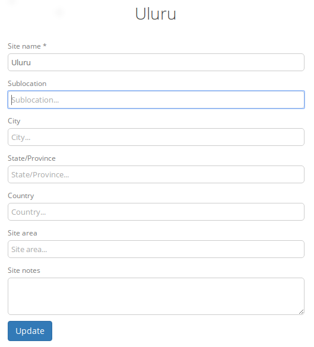

Your organisation
-----------------

This is where understanding the concepts in camelot is invaluable. On
this menu, concepts are on the left, and the details about the selected
concept are on the right.

You'll notice Sites and Cameras are not *within* a survey. This allows
for some more sophisticated, *longitudinal* reports, where data is not
only able to be analysed by survey, but also across multiple surveys.
For the same reason, reports live in this menu too.

.. figure:: screenshot/your-organisation.png
   :alt: 

Each concept can be selected from the menu on the left, and then a
specific entry navigated to using the menu on the right. You'll find
that this is a common pattern in Camelot.

Surveys
~~~~~~~

Surveys you'll already be familiar with. The right hand side shows all
surveys, and allows you to add a survey. You can click on any survey in
the list to manage it, but let's first look at the other concepts.

Sites
~~~~~

The sites menu will have a very similar feel to the survey menu. The
main difference is that a site can be created just by entering a name
and clicking "Add". This lets you set up multiple sites very quickly,
but if you want to come back and provide more information, you can click
on the entry for that site in the list to access all the details.

Adding details to a site is just a matter of filling in the fields and
clicking "Update".

Cameras
~~~~~~~

The camera menu functions almost identically sites menu just discussed.
Cameras are added by entering its name and pressing add right in the
right-hand menu, though you're free to edit the camera afterwards to
give more details too. After creating a camera you'll notice a label
alongside each camera (most likely "Available for use" if you've just
added one).

A handy feature is being able to filter the list to find all cameras
with a particular status or camera name. For example, imagine you have
dozens of cameras, many of which are in the field, you can search
"available" to see the cameras marked "Available For Use". Camelot
ensures the camera status is updated as it is used in, and removed from,
camera trap stations.

Reports
~~~~~~~

A *report* is an export of data to a CSV. Clicking on a report will take
you to a report configuration screen, where you can set constraints for
that report (e.g., to report on a specific survey) and then generate the
data as a CSV.

Camelot comes with a bunch of reports out of the box. For advanced
users, it also lets you build and add your own reports. Reports will be
covered in much more detail later.
